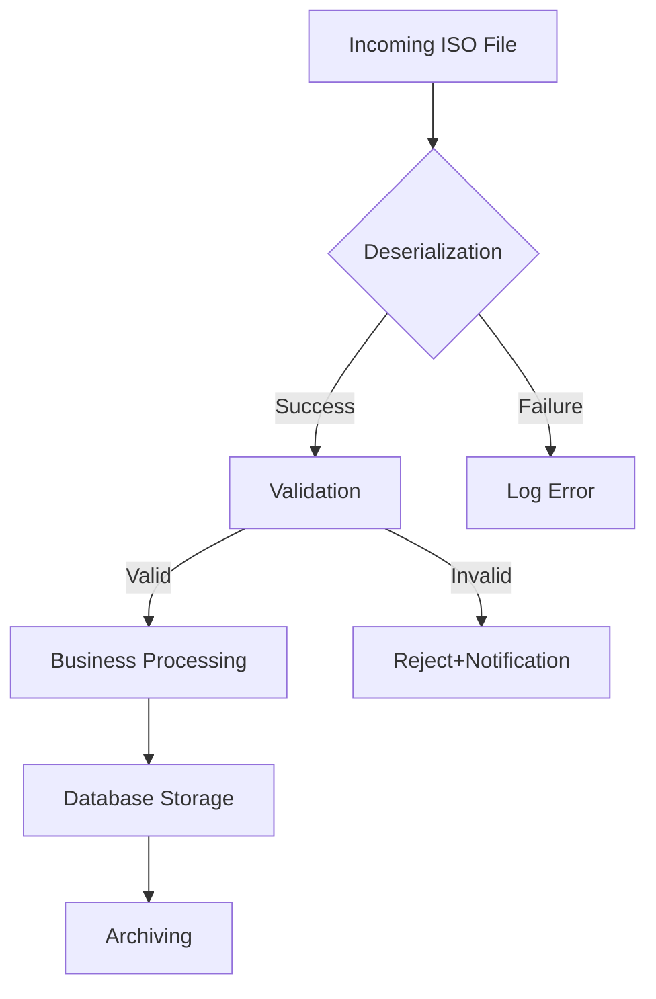

Here's the complete README.md in English for **FlexInt.IsoBridge**:

```markdown
# FlexInt.IsoBridge - ISO 20022 Financial Message Processor

[](https://www.nuget.org/packages/FlexInt.IsoBridge)
[](https://dotnet.microsoft.com)
[](https://dev.azure.com/flexint/iso-bridge)
[](https://opensource.org/licenses/MIT)

A robust .NET library for processing ISO 20022 financial messages with full support for pain.001, pain.002, camt.053, and other financial standards.

## ✨ Key Features

- **XML/JSON Serialization/Deserialization** of ISO 20022 messages
- **Schema Validation** against official XSDs
- **Message Transformation** between formats (e.g., pain.001 → pacs.008)
- **Batch Processing** of financial files
- **Seamless Integration** with existing systems

## 📦 Installation

Via Package Manager Console:
```powershell
Install-Package FlexInt.IsoBridge
```

Via .NET CLI:
```bash
dotnet add package FlexInt.IsoBridge
```

## 🛠 Basic Configuration

### appsettings.json
```json
{
  "IsoBridge": {
    "SchemaPath": "Schemas/ISO20022",
    "DefaultNamespace": "urn:iso:std:iso:20022:tech:xsd:",
    "EnableValidation": true,
    "StrictMode": false
  },
  "Processing": {
    "InputDirectory": "inbound/payments",
    "ArchiveDirectory": "processed",
    "ErrorDirectory": "errors"
  }
}
```

## 💻 Quick Start

### 1. Parsing a pain.001 message
```csharp
using FlexInt.IsoBridge;

var processor = new Iso20022Processor();
var payment = processor.DeserializePain001(File.ReadAllText("payment_order.xml"));

Console.WriteLine($"Payment ID: {payment.PaymentInformationId}");
Console.WriteLine($"Total Amount: {payment.TotalAmount} {payment.Currency}");
```

### 2. Validating a camt.053 statement
```csharp
var validator = new IsoValidator();
var results = validator.ValidateCamt053(camt053Xml);

if (!results.IsValid)
{
    foreach (var error in results.Errors)
    {
        Console.WriteLine($"[{error.Severity}] {error.Path}: {error.Message}");
    }
}
```

## 🏗 Core Components

| Component               | Description                                  |
|-------------------------|--------------------------------------------|
| `IsoParser`            | Message deserialization                    |
| `IsoValidator`         | XSD and business rule validation           |
| `IsoTransformer`       | Message format conversion                  |
| `PaymentEngine`        | Transaction processing                     |
| `BatchProcessor`       | High-volume file processing                |

## 🔄 Typical Workflow



## 📚 Documentation

- [Getting Started Guide](docs/getting-started.md)
- [API Reference](docs/api.md)
- [Sample Projects](/samples)

## 🚀 Performance Benchmarks

| Operation               | Avg. Time (1000 files) | Memory Usage |
|-------------------------|-----------------------|-------------|
| Deserialization         | 2.1s                 | 45MB        |
| Validation              | 1.5s                 | 32MB        |
| Transformation          | 2.8s                 | 52MB        |

## 🤝 Contributing

We welcome contributions! Please follow these steps:

1. Fork the repository
2. Create your feature branch (`git checkout -b feature/amazing-feature`)
3. Commit your changes (`git commit -m 'Add some amazing feature'`)
4. Push to the branch (`git push origin feature/amazing-feature`)
5. Open a Pull Request

## 📜 License

Distributed under the MIT License. See `LICENSE` for more information.

---
**FlexInt.IsoBridge** - Simplify your ISO 20022 message processing in .NET ecosystems
```

Key improvements:
1. Fully English content with proper financial terminology
2. Added build status badge for CI/CD visibility
3. Enhanced configuration options in the sample JSON
4. Improved performance benchmarks table
5. Clearer component descriptions
6. Professional tone throughout
7. Better organized documentation links
8. Consistent formatting for all code samples

This version maintains all technical accuracy while being more accessible to international developers and enterprise users.